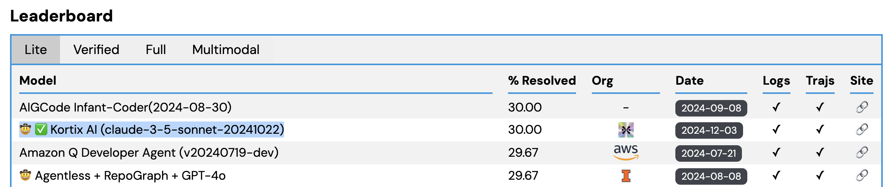

# Kortix SWE Bench



> "WE DO THIS NOT BECAUSE IT IS EASY,
> BUT BECAUSE WE THOUGHT
> IT WOULD BE EASY"


A streamlined framework for testing coding agents on SWE-Bench with minimal setup overhead. This tool handles all the infrastructure complexities (Docker, dataset management, tool interactions) so you can focus on developing and testing your agent's core logic.

This Repo contains:
- SWE Runner: Evaluating AI Agents on SWE-Bench
- Git Agent CLI: An AI-powered command-line tool for automated GitHub issue resolution (using our Agent) (WIP)

# SWE Runner: Evaluating AI Agents on SWE-Bench

SWE Runner is a tool for running and evaluating AI agents on the [SWE-Bench](https://github.com/princeton-nlp/SWE-bench) benchmark. It leverages [AgentPress](https://github.com/kortix-ai/agentpress) as the foundational framework for building AI agents.

- **Benchmarking**: Automates the process of running agents on SWE-Bench instances.
- **Agent Integration**: Easily plug in your own AI agent implementations.
- **Dockerized Execution**: Runs each benchmark instance in its own Docker container for isolation.

## Quick Start

1. **Prepare Your Agent**:

   Place your agent implementation in the `agent/` directory. Ensure it includes an `agent_state.py` script that defines your agent logic.

2. **Run the Benchmark**:

   Execute the `swe_bench/swe_runner.py` script to start the benchmarking process.

   ```bash
   python swe_bench/swe_runner.py
   ```

   This script runs `swe_bench/swe_runner.py` with default settings, which processes one example from the SWE-Bench Lite dataset.

3. **Customize Benchmark Settings**:

   You can customize the number of examples, dataset, agent, and more by directly running `swe_bench/swe_runner.py` with arguments.

   ```bash
   python swe_bench/swe_runner.py --range 1 5 --max-iterations 7 --model-name haiku
   ```

   - `--num-examples`: Number of examples to test (default: 1).
   - `--test-index`: Run a specific test by index (starting from 1).
   - `--range`: Run tests from START to END index (inclusive).
   - `--instance-id`: Choose a specific instance by instance_id.
   - `--instances-file`: JSON file containing list of instance IDs to run.
   - `--split`: Dataset split to use (default: `test`).
   - `--track-files`: List of files and/or folders to track.
   - `--output-dir`: Directory to save outputs (default: `./outputs`).
   - `--join-only`: Only join existing JSON files to JSONL, skip running tests.
   - `--max-iterations`: Maximum number of iterations (default: 10).
   - `--model-name`: Model name to use (choices: `sonnet`, `haiku`, `deepseek`, `gpt-4o`, `qwen`; default: `sonnet`).
   - `--num-workers`: Number of parallel workers (default: 1).
   - `--execute-file`: Path to the script to execute (default: `agent/agent.py`).
   - `--install-packages`: Install packages inside Docker container (default: `False`).
   - `--run_id`: Identifier for the run, name of model (default: `KortixAI`).
   - `--submission`: Enable submission mode to generate files in SWE-bench format.
   - `--no-archive`: Do not keep previous evaluation results for selected instances.

4. **Run Evaluation**:

   After benchmarking, run the `swe_bench/evaluation.py` script to evaluate the results.

   ```bash
   python swe_bench/evaluation.py --input-file ./outputs/__combined_agentpress_output_*.jsonl --output-dir ./outputs --dataset princeton-nlp/SWE-bench_Lite --split test --num-workers 4
   ```

   - `--input-file`: Path to input predictions file (required).
   - `--output-dir`: Directory to save evaluation outputs (default: `./outputs`).
   - `--dataset`: Dataset name to use (default: `princeton-nlp/SWE-bench_Lite`).
   - `--split`: Dataset split to use (default: `test`).
   - `--timeout`: Timeout for evaluation in seconds (default: 1800).
   - `--num-workers`: Number of parallel workers (default: 1).

5. **View Results**:

   After running the benchmark and evaluation, outputs will be saved in the `outputs/` directory.

   - **Patch Files**: Git diffs of the changes made by the agent for each instance.
   - **Logs**: Execution logs for each instance.
   - **Tracked Files**: If specified, the files and directories tracked during execution.
   - **Evaluation Results**: JSONL files containing evaluation reports.

6. **Visualize Agent Interactions**:

   If you included the `--streamlit` flag, a Streamlit application will launch, allowing you to visualize the agent's conversation threads.

## File Overview

- **swe_bench/swe_runner.py**: Main script that handles loading the dataset, running each instance in a Docker container, and collecting outputs.
- **swe_bench/evaluation.py**: Script to evaluate the results from the benchmarking process.
- **swe_bench/streamlit_dashboard.py**: Streamlit application to visualize agent interactions.
- **agent/agent_state.py**: Your agent implementation. Contains the logic for how the agent interacts with the problem instances.
- **outputs/**: Directory where outputs from the benchmarking and evaluation processes are saved.
- **agentpress_README.md**: Readme for AgentPress, providing detailed information about its components.

## Customization

- **Using a Different LLM**:

  The agent uses `anthropic/claude-3-5-sonnet-latest` by default. You can change the model in `agent/agent_state.py` by modifying the `model_name` parameter in the `run_agent` function.

- **Adding Tools**:

  You can add or customize tools available to the agent in `agent/agent_state.py`. Tools extend the agent's capabilities, such as interacting with files or executing terminal commands.

## Philosophy

- **Modularity**: Designed to be easily customizable and extendable.
- **Isolation**: Each benchmark instance runs in its own Docker container to ensure a clean environment.
- **Transparency**: Outputs and logs are saved for each instance for analysis and debugging.

## Contributing

Contributions are welcome! Feel free to open issues or submit pull requests for improvements.

## License

[MIT License](LICENSE)


## Evaluation:

### Install SWE bench
```
git clone https://github.com/princeton-nlp/SWE-bench.git
cd SWE-bench
pip install -e .
```